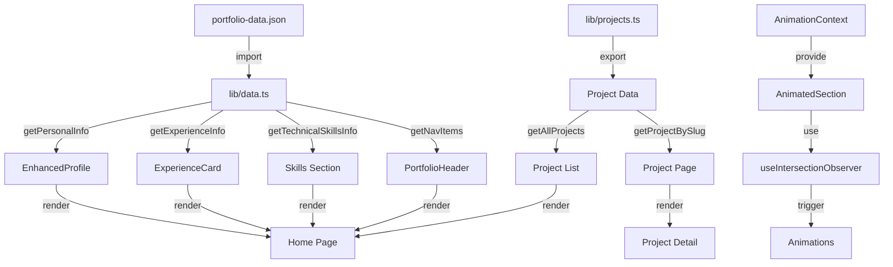

# Morar.dev Portfolio Application Documentation

## Table of Contents
1. [Project Overview](#project-overview)
2. [Technology Stack](#technology-stack)
3. [Architecture](#architecture)
4. [Project Structure](#project-structure)
5. [Key Features](#key-features)
6. [Data Flow](#data-flow)
7. [Component Architecture](#component-architecture)
8. [Animation System](#animation-system)
9. [Styling System](#styling-system)
10. [Development Setup](#development-setup)
11. [Deployment](#deployment)

---

## Project Overview

**Morar.dev** is a modern, responsive portfolio website showcasing the work and expertise of Dmytro Morar, a React/Next.js developer with 7+ years of experience. The application features a dark-themed, animated interface that presents professional information, technical skills, work experience, and project showcases.

### Purpose
- Display professional profile and credentials
- Showcase technical skills and expertise
- Present work experience and achievements
- Feature portfolio projects with detailed views
- Provide contact information and CV download

### Key Characteristics
- **Dark Theme**: Zinc/black color scheme with cyan accent colors
- **Animated UI**: Custom animation system with intersection observer
- **Responsive Design**: Mobile-first approach with breakpoints
- **Type-Safe**: Full TypeScript implementation
- **Performance-Optimized**: Next.js App Router with optimized images

---

## Technology Stack

### Core Framework
- **Next.js 14.2.25** - React framework with App Router
- **React 18.2.0** - UI library
- **TypeScript 5** - Type safety

### Styling
- **Tailwind CSS 3.4.17** - Utility-first CSS framework
- **tailwindcss-animate** - Animation utilities
- **PostCSS** - CSS processing

### UI Components
- **Radix UI** - Headless UI primitives (30+ components)
- **shadcn/ui** - Component library built on Radix UI
- **Lucide React** - Icon library

### Form Handling
- **React Hook Form 7.49.3** - Form state management
- **Zod 3.22.4** - Schema validation
- **@hookform/resolvers** - Form validation resolvers

### Additional Libraries
- **next-themes** - Theme management
- **date-fns** - Date utilities
- **class-variance-authority** - Component variant management
- **clsx** & **tailwind-merge** - Conditional class utilities

---

## Architecture

### App Router Structure
The application uses Next.js 14 App Router with the following structure:

```
app/
├── layout.tsx          # Root layout with providers
├── page.tsx            # Home page
├── projects/
│   └── [slug]/
│       ├── page.tsx    # Dynamic project pages
│       └── not-found.tsx
└── globals.css         # Global styles
```

### Component-Based Architecture
- **Reusable Components**: Located in `components/` directory
- **UI Primitives**: shadcn/ui components in `components/ui/`
- **Context Providers**: Animation context for global state
- **Custom Hooks**: Intersection observer and other utilities

### Data Management
- **JSON-Based**: Portfolio data stored in `data/portfolio-data.json`
- **Type-Safe Access**: Helper functions in `lib/data.ts` and `lib/projects.ts`
- **Static Generation**: Data loaded at build time

### Routing
- **Static Routes**: Home page (`/`)
- **Dynamic Routes**: Project pages (`/projects/[slug]`)
- **Hash Navigation**: Section anchors (`#skills`, `#experience`)

---

## Project Structure

```
morar.dev/
├── app/                          # Next.js App Router
│   ├── layout.tsx               # Root layout with providers
│   ├── page.tsx                 # Home page
│   ├── globals.css              # Global styles
│   ├── projects/
│   │   └── [slug]/
│   │       ├── page.tsx         # Dynamic project pages
│   │       └── not-found.tsx    # 404 for projects
│   └── fonts/                   # Custom fonts (Geist)
│
├── components/                  # React components
│   ├── ui/                      # shadcn/ui components
│   ├── animated-section.tsx     # Animation wrapper
│   ├── enhanced-profile.tsx     # Profile card with tabs
│   ├── portfolio-header.tsx     # Navigation header
│   ├── experience-card.tsx      # Work experience display
│   ├── project-card.tsx          # Project thumbnail
│   ├── scroll-progress-indicator.tsx
│   └── ...                      # Other components
│
├── contexts/                    # React contexts
│   └── animation-context.tsx    # Animation settings provider
│
├── data/                        # Data sources
│   └── portfolio-data.json      # Portfolio information
│
├── hooks/                       # Custom React hooks
│   └── use-intersection-observer.ts
│
├── lib/                         # Utility functions
│   ├── data.ts                  # Portfolio data accessors
│   ├── projects.ts              # Project data management
│   └── utils.ts                 # General utilities
│
├── public/                      # Static assets
│   ├── *.png                    # Images
│   ├── *.jpg                    # Photos
│   └── *.pdf                    # Documents (CV)
│
├── next.config.mjs              # Next.js configuration
├── tailwind.config.ts           # Tailwind CSS configuration
├── tsconfig.json                # TypeScript configuration
└── package.json                 # Dependencies
```

---

## Key Features

### 1. Professional Profile Display
- **Enhanced Profile Component**: Sticky sidebar with avatar, badges, and social links
- **Tabbed Interface**: About and Contact information
- **Language Proficiency**: Visual progress bars
- **Availability Status**: Real-time work availability indicator
- **CV Download**: Direct PDF download functionality

### 2. Technical Skills Showcase
- **Categorized Skills**: Core, React ecosystem, Tools, Team Work, Other, Soft Skills
- **Visual Tags**: Badge-based skill display
- **Animated Sections**: Staggered animations for skill categories

### 3. Work Experience Timeline
- **Experience Cards**: Detailed work history with:
  - Job title and company
  - Employment period
  - Role description
  - Key achievements (bulleted list)
  - Technology stack badges
- **Chronological Display**: Most recent first

### 4. Project Portfolio
- **Project Listings**: Grid-based project showcase (currently commented out on home)
- **Dynamic Project Pages**: Individual project detail pages with:
  - Cover image and description
  - Feature lists
  - Technology stack
  - Project gallery
  - Related projects
  - Live and GitHub links

### 5. Navigation System
- **Sticky Header**: Transparent to solid on scroll
- **Active Section Detection**: Automatic highlighting based on scroll position
- **Mobile Menu**: Full-screen overlay navigation
- **Smooth Scrolling**: Hash-based section navigation

### 6. Animation System
- **Custom Animation Context**: Global animation settings
- **Intersection Observer**: Scroll-triggered animations
- **Multiple Animation Types**: fade-up, fade-in, slide-left, slide-right, zoom-in, bounce
- **Configurable Presets**: Subtle, moderate, playful, dramatic, none
- **Performance Optimized**: Animations freeze once visible

### 7. Scroll Indicators
- **Progress Bar**: Top-of-page scroll progress indicator
- **Scroll to Top**: Enhanced scroll indicator with smooth scrolling

### 8. Responsive Design
- **Mobile-First**: Optimized for all screen sizes
- **Breakpoints**: sm, md, lg, xl, 2xl
- **Adaptive Layouts**: Grid and flexbox with responsive columns
- **Touch-Friendly**: Mobile menu and interactions

---

## Data Flow

### Architecture Diagram



### Data Access Pattern

1. **Data Source**: `data/portfolio-data.json` contains all portfolio information
2. **Access Layer**: `lib/data.ts` provides typed helper functions:
   - `getPersonalInfo()` - Personal information
   - `getAboutInfo()` - Bio and languages
   - `getExperienceInfo()` - Work history
   - `getTechnicalSkillsInfo()` - Skills by category
   - `getNavItems()` - Navigation structure
   - `getMetaInfo()` - SEO metadata

3. **Project Data**: `lib/projects.ts` manages project information:
   - `getAllProjects()` - All projects array
   - `getProjectBySlug(slug)` - Single project by slug
   - `getRelatedProjects(slug, limit)` - Related projects

4. **Component Consumption**: Components import and use these functions
5. **Type Safety**: TypeScript interfaces ensure data structure consistency

---

## Component Architecture

### Core Components

#### 1. EnhancedProfile (`components/enhanced-profile.tsx`)
**Purpose**: Display personal information in a sticky sidebar

**Features**:
- Avatar with border styling
- Name, title, and location
- Badge display for key technologies
- Social links integration
- Tabbed interface (About/Contact)
- Language proficiency bars
- CV download button
- Availability status indicator

**Props**: None (uses data from `lib/data.ts`)

#### 2. PortfolioHeader (`components/portfolio-header.tsx`)
**Purpose**: Navigation header with scroll detection

**Features**:
- Sticky positioning
- Background blur on scroll
- Active section highlighting
- Mobile menu overlay
- Smooth scroll animations
- Responsive breakpoints

**State Management**:
- `scrolled` - Scroll position state
- `mobileMenuOpen` - Mobile menu visibility
- `activeSection` - Current visible section

#### 3. AnimatedSection (`components/animated-section.tsx`)
**Purpose**: Wrapper component for scroll-triggered animations

**Features**:
- Intersection Observer integration
- Multiple animation types
- Configurable delay and intensity
- Respects global animation settings
- Performance optimized (freeze once visible)

**Props**:
- `animation`: Animation type
- `delay`: Stagger delay multiplier
- `threshold`: Intersection threshold
- `rootMargin`: Observer margin
- `id`: Section identifier
- `forceAnimate`: Override settings

#### 4. ExperienceCard (`components/experience-card.tsx`)
**Purpose**: Display individual work experience entries

**Features**:
- Job title and company
- Employment period badge
- Description text
- Key achievements list with icons
- Technology stack badges
- Responsive layout

**Props**:
- `title`, `company`, `period`, `description`
- `achievements[]`, `technologies[]`

#### 5. Project Page (`app/projects/[slug]/page.tsx`)
**Purpose**: Dynamic project detail pages

**Features**:
- Cover image with overlay
- Project description paragraphs
- Feature list
- Technology tags
- Project gallery grid
- Related projects sidebar
- Live and GitHub links
- Back navigation

### Component Hierarchy

```
RootLayout
├── AnimationProvider
│   ├── ScrollProgressIndicator
│   └── Home Page
│       ├── PortfolioHeader
│       ├── EnhancedProfile (sticky)
│       ├── Skills Section
│       │   └── AnimatedSection (multiple)
│       └── Experience Section
│           └── ExperienceCard (multiple)
│               └── AnimatedSection
└── Project Pages
    ├── PortfolioHeader
    ├── Project Header
    ├── Project Content
    └── Project Sidebar
```

---

## Animation System

### Architecture

The animation system uses a combination of React Context, Intersection Observer API, and CSS transitions to create performant, scroll-triggered animations.

### Components

#### 1. AnimationContext (`contexts/animation-context.tsx`)
**Purpose**: Global animation settings management

**Features**:
- Persistent settings (localStorage)
- Animation presets (subtle, moderate, playful, dramatic, none)
- Customizable parameters:
  - `duration`: Animation duration in ms
  - `delay`: Base delay multiplier
  - `easing`: CSS easing function
  - `intensity`: Animation scale factor (0-1)
  - `enabled`: Toggle animations on/off

**API**:
- `useAnimation()` - Hook to access settings
- `updateSettings()` - Update individual settings
- `applyPreset()` - Apply preset configuration

#### 2. useIntersectionObserver (`hooks/use-intersection-observer.ts`)
**Purpose**: React hook for Intersection Observer API

**Features**:
- Configurable threshold and rootMargin
- Freeze once visible option
- Automatic cleanup
- Type-safe ref return

**Returns**:
- `ref`: Element reference
- `isIntersecting`: Boolean intersection state

#### 3. AnimatedSection (`components/animated-section.tsx`)
**Purpose**: Animation wrapper component

**Animation Types**:
- `fade-up`: Fade in with upward translation
- `fade-in`: Simple opacity fade
- `slide-left`: Slide in from right
- `slide-right`: Slide in from left
- `zoom-in`: Scale up with fade
- `bounce`: Upward bounce effect

**Animation Flow**:
1. Component mounts with initial hidden state
2. Intersection Observer watches for visibility
3. When intersecting, applies visible styles
4. Animation respects global settings (duration, easing, intensity)
5. Once visible, observer disconnects (performance)

### Animation Presets

| Preset | Duration | Delay | Easing | Intensity |
|--------|----------|-------|--------|-----------|
| Subtle | 500ms | 50ms | ease-out | 0.3 |
| Moderate | 700ms | 100ms | ease-out | 0.5 |
| Playful | 800ms | 150ms | ease-in-out | 0.7 |
| Dramatic | 1000ms | 200ms | ease-in-out | 1.0 |
| None | - | - | - | Disabled |

---

## Styling System

### Tailwind CSS Configuration

The application uses Tailwind CSS with custom configuration:

**Color Palette**:
- **Background**: Black (`bg-black`)
- **Cards**: Zinc 900 with transparency (`bg-zinc-900/70`)
- **Borders**: Zinc 800 (`border-zinc-800`)
- **Accent**: Cyan 400 (`text-cyan-400`)
- **Text**: White/Zinc scale for hierarchy

**Design Tokens**:
- Border radius: Custom radius variables
- Spacing: Standard Tailwind scale
- Typography: Inter font family
- Shadows: Custom backdrop blur effects

### Custom Styles

**Global Styles** (`app/globals.css`):
- CSS variables for theming
- Base typography styles
- Custom animations (accordion)

**Component Styles**:
- Utility-first approach with Tailwind
- Conditional classes with `cn()` utility
- Inline styles for dynamic values (animations)

### Responsive Breakpoints

- `sm`: 640px
- `md`: 768px
- `lg`: 1024px
- `xl`: 1280px
- `2xl`: 1400px

### Design Patterns

1. **Glass Morphism**: Backdrop blur with transparency
2. **Gradient Accents**: Cyan to blue gradients
3. **Grid Background**: Radial gradient dot pattern
4. **Card-Based Layout**: Elevated cards with borders
5. **Badge System**: Rounded pill badges for tags

---

## Development Setup

### Prerequisites
- Node.js 18+ (or latest LTS)
- pnpm (package manager)

### Installation

```bash
# Install dependencies
pnpm install

# Run development server
pnpm dev

# Build for production
pnpm build

# Start production server
pnpm start

# Run linter
pnpm lint
```

### Development Server
- **URL**: http://localhost:3000
- **Hot Reload**: Enabled
- **TypeScript**: Strict mode enabled

### Project Configuration

**Next.js** (`next.config.mjs`):
- Default configuration
- Image optimization enabled
- App Router enabled

**TypeScript** (`tsconfig.json`):
- Strict mode
- Path aliases (`@/*` → `./*`)
- Next.js plugin enabled

**Tailwind** (`tailwind.config.ts`):
- Content paths configured
- Custom theme extensions
- Animation plugin enabled

### Code Structure Guidelines

1. **Components**: Use functional components with TypeScript
2. **Client Components**: Mark with `"use client"` when needed
3. **Server Components**: Default for pages and layouts
4. **Data Fetching**: Use helper functions from `lib/`
5. **Styling**: Prefer Tailwind utilities over custom CSS
6. **Animations**: Wrap content in `AnimatedSection` for scroll effects

---

## Deployment

### Build Process

```bash
# Create production build
pnpm build

# Output directory: .next/
```

### Build Output
- Static pages (home, project pages)
- Optimized images
- Minified JavaScript and CSS
- TypeScript compiled to JavaScript

### Deployment Options

**Vercel** (Recommended):
- Automatic deployments from Git
- Next.js optimized
- Edge functions support
- Environment variables configuration

**Other Platforms**:
- Netlify
- AWS Amplify
- Self-hosted (Node.js server)

### Environment Variables
Currently none required. If adding features like:
- Analytics
- Contact form backend
- CMS integration

Add to `.env.local`:
```
NEXT_PUBLIC_ANALYTICS_ID=...
```

### Performance Considerations

1. **Image Optimization**: Next.js Image component with optimization
2. **Code Splitting**: Automatic with App Router
3. **Static Generation**: Pre-rendered pages where possible
4. **Animation Performance**: CSS transforms (GPU accelerated)
5. **Bundle Size**: Tree-shaking with ES modules

### SEO

**Metadata** (`app/layout.tsx`):
- Title and description from `portfolio-data.json`
- Open Graph tags (can be extended)
- Semantic HTML structure

**Improvements**:
- Add sitemap.xml
- Add robots.txt
- Implement structured data (JSON-LD)
- Add Open Graph images

---

## Future Enhancements

### Potential Features
1. **Projects Section**: Uncomment and enhance project showcase on home
2. **Blog**: Add blog functionality for articles
3. **Contact Form**: Backend integration for contact form
4. **Dark/Light Theme**: Theme switcher (next-themes already installed)
5. **Analytics**: Integration with analytics service
6. **CMS Integration**: Headless CMS for content management
7. **Internationalization**: Multi-language support
8. **Search**: Project and content search functionality

### Technical Improvements
1. **Testing**: Add unit and integration tests
2. **E2E Testing**: Playwright or Cypress
3. **Performance Monitoring**: Web Vitals tracking
4. **Accessibility**: Enhanced ARIA labels and keyboard navigation
5. **PWA**: Progressive Web App features
6. **Offline Support**: Service worker implementation

---

## Conclusion

The Morar.dev portfolio application is a modern, performant, and well-structured Next.js application showcasing professional work. It demonstrates best practices in:

- **Component Architecture**: Reusable, composable components
- **Type Safety**: Full TypeScript implementation
- **Performance**: Optimized animations and images
- **User Experience**: Smooth animations and responsive design
- **Code Organization**: Clear separation of concerns

The application serves as both a portfolio showcase and a demonstration of modern React/Next.js development practices.

