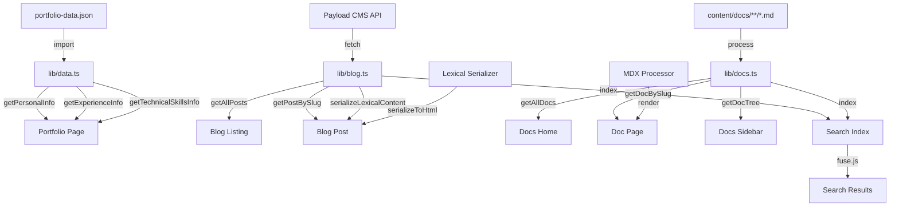

# Morar.dev Architecture - Source of Truth

**Last Updated:** 2024  
**Architecture Decision:** Option #1 - Single Next.js Site

## Executive Summary

This document defines the architecture and implementation strategy for morar.dev, a unified Next.js application that combines:
1. **Portfolio Section** - Professional experience, skills, and projects
2. **Blog Section** - Articles on AI, software development, book reviews, and essays
3. **Documentation/Vault** - Personal knowledge base (DevWiki) with Obsidian markdown files

All three sections are unified in a single Next.js application for optimal SEO, maintainability, and user experience.

---

## Architecture Decision: Single Next.js Site

### Why Option #1?

**Selected:** Single Next.js Site (Unified Application)

**Rationale:**
- ✅ **Unified SEO**: Single domain maximizes search engine authority
- ✅ **Code Reusability**: Shared components, styling, and utilities
- ✅ **Simplified Deployment**: One build, one deployment pipeline
- ✅ **Lower Maintenance**: Single codebase to maintain and update
- ✅ **Cost Effective**: Free hosting on Vercel (or self-hosted)
- ✅ **Consistent UX**: Unified navigation and design system
- ✅ **Current Stack**: Already using Next.js 14 with App Router

**Rejected Alternatives:**
- ❌ **Separate Apps**: Splits SEO, increases maintenance, code duplication
- ❌ **Separate CMS**: Overkill for monthly blog posts, adds cost/complexity
- ❌ **Separate Framework for Docs**: Unnecessary overhead, styling inconsistencies

---

## Technical Stack

### Core Framework
- **Next.js 14+** (App Router) - React framework
- **React 18+** - UI library
- **TypeScript 5+** - Type safety
- **Tailwind CSS 3.4+** - Styling (already configured)

### Content Processing
- **MDX** - Markdown with JSX support
  - Library: `next-mdx-remote` or `@next/mdx`
  - Syntax highlighting: `shiki` or `prism-react-renderer`
- **gray-matter** - Frontmatter parsing
- **remark/rehype** - Markdown transformation plugins

### Documentation Features
- **fuse.js** - Client-side search
- **reading-time** - Calculate reading time
- **date-fns** - Date formatting (already installed)

### SEO & Analytics
- **next-seo** - SEO optimization
- **next-sitemap** - Sitemap generation
- Privacy-friendly analytics (optional)

### Data Management
- **JSON**: `data/portfolio-data.json` - Portfolio data (source of truth)
- **Payload CMS API**: `https://cms.morar.dev/api/posts` - Blog posts (headless CMS)
- **Markdown**: `content/docs/` - Documentation from Obsidian

---

## Project Structure

```
morar.dev/
├── app/                          # Next.js App Router
│   ├── layout.tsx               # Root layout
│   ├── page.tsx                 # Portfolio home (/)
│   ├── blog/
│   │   ├── page.tsx             # Blog listing (/blog)
│   │   └── [slug]/
│   │       └── page.tsx         # Blog post (/blog/[slug])
│   ├── docs/
│   │   ├── page.tsx             # Docs home (/docs)
│   │   └── [...slug]/
│   │       └── page.tsx         # Doc pages (/docs/[...slug])
│   └── projects/
│       └── [slug]/
│           └── page.tsx         # Project pages (existing)
│
├── components/                   # React components
│   ├── ui/                      # shadcn/ui components (existing)
│   ├── blog/
│   │   ├── blog-card.tsx        # Blog post card
│   │   ├── blog-post.tsx        # Blog post renderer
│   │   ├── blog-navigation.tsx  # Prev/next navigation
│   │   └── blog-tags.tsx        # Tag filtering
│   ├── docs/
│   │   ├── docs-sidebar.tsx     # Hierarchical navigation
│   │   ├── docs-content.tsx     # Doc content renderer
│   │   ├── docs-search.tsx      # Search component (Cmd+K)
│   │   ├── docs-toc.tsx         # Table of contents
│   │   └── docs-breadcrumbs.tsx # Breadcrumb navigation
│   └── [existing components]    # Portfolio components
│
├── content/                      # Content files
│   └── docs/
│       ├── react/
│       │   ├── hooks.md
│       │   ├── context.md
│       │   └── performance.md
│       ├── typescript/
│       │   ├── types.md
│       │   └── generics.md
│       └── [category]/
│           └── [page].md
│
├── lib/                          # Utility functions
│   ├── data.ts                  # Portfolio data accessors (existing)
│   ├── projects.ts              # Project utilities (existing)
│   ├── blog.ts                  # Blog utilities (Payload CMS integration)
│   ├── payload.ts               # Payload CMS API configuration
│   ├── docs.ts                  # Documentation utilities
│   ├── mdx.ts                   # MDX processing
│   └── utils.ts                 # General utilities (existing)
│
├── data/
│   └── portfolio-data.json      # Portfolio source of truth (existing)
│
└── public/                      # Static assets (existing)
```

---

## Content Management Strategy

### 1. Portfolio Data
**Source:** `data/portfolio-data.json`

**Purpose:**
- Personal information
- Work experience
- Technical skills
- Projects metadata
- Social links

**Update Process:**
- Manual JSON editing
- Single source of truth for portfolio, LinkedIn (via n8n), and CV generation

**Future Automation:**
- n8n workflow watches JSON changes
- Updates LinkedIn profile via API
- Generates updated CV PDF

### 2. Blog Posts
**Source:** Payload CMS API (`https://cms.morar.dev/api/posts`)

**CMS Platform:**
- Payload CMS (headless CMS)
- Lexical rich text editor
- REST API for content delivery
- Admin panel at `https://cms.morar.dev/admin`

**Content Structure:**
- Title, slug, content (Lexical format)
- Publication date (`publishedAt`)
- Author information
- Meta fields (title, description for SEO)
- Support for code blocks, images, banners, and custom blocks

**Update Process:**
1. Access Payload CMS admin panel
2. Create/edit posts in the admin interface
3. Publish posts (status: `published`)
4. Content automatically available via API
5. Next.js fetches and renders at build time (SSG)

**Integration:**
- Static Site Generation (SSG) at build time
- Incremental Static Regeneration (ISR) with 1-hour revalidation
- Lexical content serialized to HTML server-side
- Reading time calculated automatically from content

### 3. Documentation/Vault
**Source:** `content/docs/**/*.md` (synced from Obsidian)

**Structure:**
- Hierarchical folder structure matching Obsidian vault
- Each category is a folder (react/, typescript/, etc.)
- Files maintain Obsidian markdown format

**Frontmatter Template:**
```yaml
---
title: "Page Title"
description: "Brief description"
category: "react"
order: 1 # For sidebar ordering
---
```

**Obsidian Sync Process:**
1. Write/edit in Obsidian
2. Export or copy markdown files to `content/docs/`
3. Maintain folder structure
4. Add frontmatter if needed
5. Commit and deploy

**Future Enhancement:**
- Git hook to auto-sync from Obsidian vault directory
- Or Obsidian plugin to export to content/docs/

---

## Feature Specifications

### Portfolio Section (/)
**Existing Features:**
- ✅ Profile display with avatar, badges, social links
- ✅ Technical skills showcase
- ✅ Work experience timeline
- ✅ Project showcase (currently commented out)

**Enhancements:**
- Add project filtering by technology
- Add testimonials section
- Add GitHub contributions widget
- Improve project case studies

### Blog Section (/blog)

**Blog Listing Page:**
- Grid/list view of blog posts
- Filter by category (AI, Development, Books, Essays)
- Filter by tags
- Search functionality
- Pagination (if >12 posts)
- Featured posts section
- Reading time display
- Publication date

**Blog Post Page:**
- Full article rendering with MDX
- Syntax highlighted code blocks
- Table of contents (for long posts)
- Related posts sidebar
- Prev/Next navigation
- Share buttons (optional)
- Author bio section
- Comments (optional - could use GitHub Discussions)

**SEO Features:**
- Dynamic meta tags per post
- Open Graph images
- Structured data (Article schema)
- Canonical URLs

### Documentation Section (/docs)

**Reference:** [Cursor Docs](https://cursor.com/docs) and [Fumadocs](https://fumadocs.dev/)

**Features to Implement:**

1. **Sidebar Navigation**
   - Hierarchical structure
   - Collapsible sections
   - Active page highlighting
   - Scroll spy (highlight current section)

2. **Search (Cmd+K)**
   - Full-text search across all docs
   - Keyboard shortcut (Cmd+K / Ctrl+K)
   - Search results with preview
   - Highlight matching terms

3. **Table of Contents**
   - Auto-generated from headings
   - Sticky positioning
   - Click to scroll to section
   - Active section highlighting

4. **Breadcrumbs**
   - Show current location in hierarchy
   - Clickable navigation path
   - Example: Docs > React > Hooks

5. **Code Blocks**
   - Syntax highlighting (shiki)
   - Copy to clipboard button
   - Language indicator
   - Line numbers (optional)

6. **Content Features**
   - Markdown rendering with MDX
   - Internal links between docs
   - External links (open in new tab)
   - Images with captions
   - Callouts/admonitions (info, warning, tip)
   - Math equations (if needed)

7. **Mobile Experience**
   - Collapsible sidebar
   - Touch-friendly navigation
   - Responsive table of contents

**URL Structure:**
- `/docs` - Documentation home
- `/docs/react` - React category
- `/docs/react/hooks` - Specific page
- `/docs/react/hooks#usestate` - Section anchor

---

## Navigation Structure

### Main Navigation (Header)
```
Home | Blog | Docs | Projects | Contact
```

### Blog Navigation
- Categories: AI, Development, Books, Essays
- Tags: Filterable tag cloud
- Archive: By year/month

### Docs Navigation
- Hierarchical sidebar
- Search (Cmd+K)
- Breadcrumbs

---

## SEO Strategy

### Technical SEO
- ✅ Sitemap generation (`/sitemap.xml`)
- ✅ Robots.txt
- ✅ Structured data (JSON-LD)
  - Person schema (portfolio)
  - Article schema (blog posts)
  - WebPage schema (docs)
- ✅ Open Graph tags
- ✅ Twitter Card tags
- ✅ Canonical URLs

### Content SEO
- **Portfolio**: Target "React Developer", "Next.js Developer", "Dima Morar"
- **Blog**: Target "how to" queries, technical tutorials
- **Docs**: Target specific technical queries (e.g., "React hooks best practices")

### Performance
- Image optimization (Next.js Image)
- Code splitting
- Static generation where possible
- Lazy loading for heavy components

---

## Implementation Phases

### Phase 1: Foundation ✅
- [x] Extend JSON schema for blog/docs metadata
- [x] Create content directory structure
- [x] Set up MDX processing

### Phase 2: Blog ✅
- [x] Payload CMS integration
- [x] Blog listing page with SSG
- [x] Blog post pages with Lexical content rendering
- [x] Static generation at build time
- [x] SEO optimization (metadata, OG tags)
- [ ] Related posts functionality
- [ ] RSS feed generation
- [ ] Post filtering and search

### Phase 3: Documentation
- [ ] Docs structure and routing
- [ ] Sidebar navigation component
- [ ] Search functionality (Cmd+K)
- [ ] Table of contents
- [ ] Breadcrumbs
- [ ] Code highlighting
- [ ] Obsidian sync documentation

### Phase 4: Integration
- [ ] Update main navigation
- [ ] Cross-linking between sections
- [ ] Unified search (optional)
- [ ] Analytics integration

### Phase 5: Polish
- [ ] SEO audit and optimization
- [ ] Performance optimization
- [ ] Accessibility audit
- [ ] Mobile experience refinement

---

## Reference Sites Analysis

### Portfolio References
- **leerob.com**: Clean design, good project showcases
- **emilkowal.ski**: Modern animations, good UX
- **ssp.sh**: Minimalist, content-focused

**Takeaways:**
- Clean, modern design
- Fast loading
- Clear navigation
- Strong typography

### Documentation References
- **cursor.com/docs**: Excellent navigation, search, TOC
- **fumadocs.dev**: Great MDX support, clean design

**Takeaways:**
- Hierarchical sidebar navigation
- Powerful search (Cmd+K)
- Auto-generated TOC
- Code syntax highlighting
- Breadcrumb navigation
- Mobile-responsive

---

## Data Flow



---

## Deployment Strategy

### Hosting
- **Primary**: Vercel (recommended for Next.js)
- **Alternative**: Self-hosted (VPS, Docker)

### Build Process
1. Next.js builds static pages where possible
2. Payload CMS posts fetched at build time (SSG)
3. Lexical content serialized to HTML at build time
4. MDX files processed at build time (for docs)
5. Search index generated at build time
6. Sitemap generated automatically

### CI/CD
- Git push triggers build
- Automatic deployments on main branch
- Preview deployments for PRs

### Environment Variables
```env
# Payload CMS Configuration
PAYLOAD_CMS_URL=https://cms.morar.dev

# Optional - for future features
NEXT_PUBLIC_ANALYTICS_ID=
NEXT_PUBLIC_SEARCH_API_KEY=
```

---

## Future Enhancements

### Short Term
- [ ] Newsletter signup
- [ ] Blog RSS feed
- [ ] Sitemap generation
- [ ] Analytics integration

### Medium Term
- [ ] n8n automation for LinkedIn sync
- [ ] CV PDF generation from JSON
- [ ] Blog comments (GitHub Discussions)
- [ ] Newsletter integration

### Long Term
- [ ] Multi-language support (i18n)
- [ ] Advanced search with Algolia
- [ ] Obsidian auto-sync workflow
- [ ] API for portfolio data
- [ ] Admin panel for content (optional)

---

## Maintenance Guidelines

### Content Updates
1. **Portfolio**: Edit `data/portfolio-data.json`
2. **Blog**: Add new `.md` file to `content/blog/`
3. **Docs**: Sync from Obsidian to `content/docs/`

### Code Updates
- Follow existing component patterns
- Use TypeScript for type safety
- Maintain consistent styling with Tailwind
- Write reusable components

### Performance Monitoring
- Monitor Core Web Vitals
- Track page load times
- Optimize images regularly
- Audit bundle size

---

## Questions & Decisions Log

### Q: Why MDX over plain Markdown?
**A:** MDX allows embedding React components in markdown, enabling interactive blog posts and documentation.

### Q: Why use Payload CMS instead of markdown files?
**A:** Payload CMS provides a user-friendly admin interface for content management, supports rich content editing with Lexical, and enables non-technical content updates. Static generation at build time ensures optimal performance while maintaining the benefits of a headless CMS.

### Q: How to handle Obsidian-specific features?
**A:** Most Obsidian markdown features (links, embeds, callouts) can be converted or replicated with remark/rehype plugins.

### Q: Should blog and docs share the same search?
**A:** Initially separate. Can unify later if needed.

---

## Conclusion

This architecture provides a unified, maintainable, and scalable solution for morar.dev that:
- Showcases professional experience
- Enables blogging and thought leadership
- Publishes personal knowledge base
- Maximizes SEO with single domain
- Minimizes maintenance overhead
- Supports future automation (LinkedIn sync, CV generation)

**This document serves as the source of truth for all architectural decisions and implementation details.**

